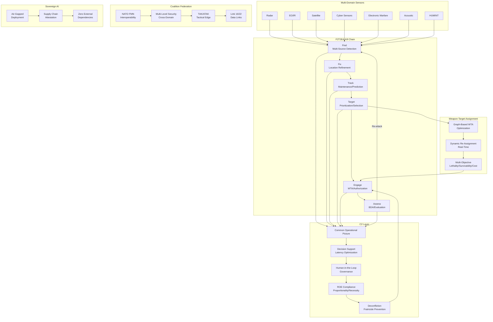
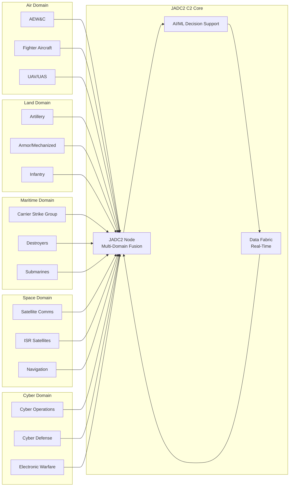
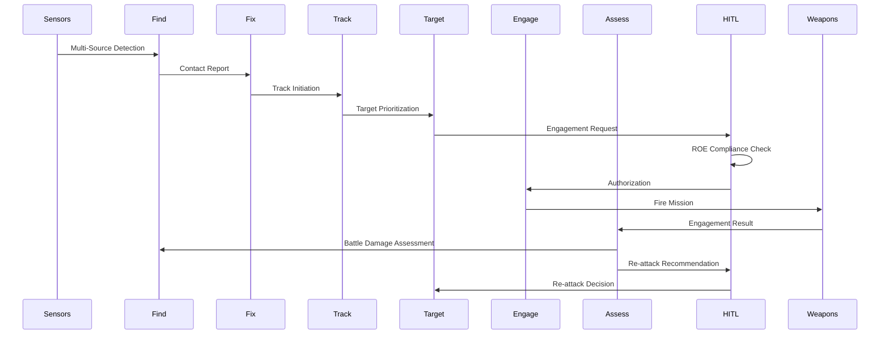
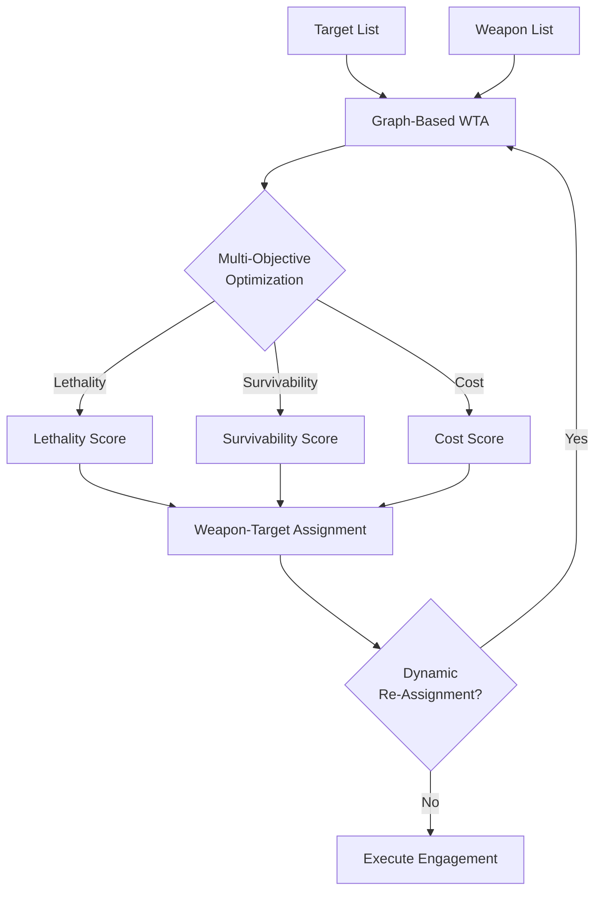
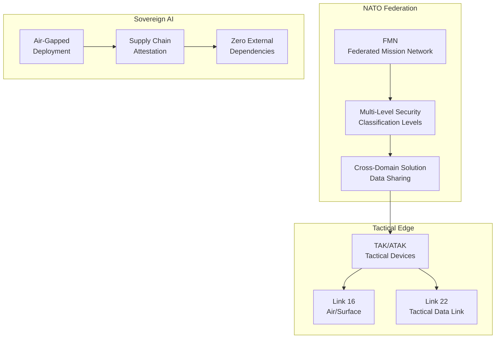

# Apex JADC2 — Joint All-Domain Command and Control

F2T2EA kill chain, coalition federation, sovereign AI, NATO interoperability.

## Table of Contents

- [Architecture](#architecture)
- [JADC2 Domain Integration](#jadc2-domain-integration)
- [F2T2EA Kill Chain](#f2t2ea-kill-chain)
- [WTA Optimization](#wta-optimization)
- [Coalition Federation](#coalition-federation)
- [Benchmark Comparisons](#benchmark-comparisons)
- [Test Suite](#test-suite)
- [License](#license)

## Architecture

## JADC2 Domain Integration

## F2T2EA Kill Chain

## WTA Optimization

## Coalition Federation

## Benchmark Comparisons

| Feature | Apex JADC2 | Palantir AIP | Anduril Lattice | PTAH-OS-CJADC2 | God's Eye View |
|---------|-----------|-----------------|-----------------|-----------------|----------------|
| F2T2EA Kill Chain | ✅ Full | ✅ Partial | ✅ Partial | ✅ Full | ❌ |
| Coalition Federation | NATO FMN/MLS | ❌ | ❌ | ✅ | ❌ |
| Sovereign AI | Air-gapped/Zero deps | ❌ | ❌ | ❌ | ❌ |
| WTA | Graph-based optimization | ❌ | ❌ | ❌ | ❌ |
| ROE Compliance | Proportionality/Necessity | ❌ | ❌ | ❌ | ❌ |
| HITL Governance | ✅ | ✅ | ✅ | ❌ | ❌ |
| Open Source | AGPL-3.0 | ❌ | ❌ | ✅ | ✅ |
| NATO Interoperability | STANAG/MIP/NFFI | ❌ | ❌ | ❌ | ❌ |
| Multi-Domain Fusion | Air/Land/Maritime/Space/Cyber | ✅ | ✅ | ✅ | ❌ |
| Real-Time Data Fabric | ✅ | ✅ | ✅ | ✅ | ❌ |
| AI/ML Decision Support | ✅ | ✅ | ✅ | ✅ | ❌ |
| Cross-Domain Solution | ✅ | ❌ | ❌ | ✅ | ❌ |
| Tactical Edge (TAK/ATAK) | ✅ | ❌ | ✅ | ❌ | ❌ |
| Supply Chain Attestation | ✅ | ❌ | ❌ | ❌ | ❌ |
| Air-Gapped Deployment | ✅ | ❌ | ❌ | ❌ | ❌ |

## Test Suite

- **372 tests** across **17 files** covering **10 topics**
- TDD-enforced with comprehensive coverage
- Topics: F2T2EA, WTA, Coalition Federation, ROE, HITL, Deconfliction, Multi-Domain Fusion, Sovereign AI, NATO Interoperability, Data Fabric

## License

AGPL-3.0
