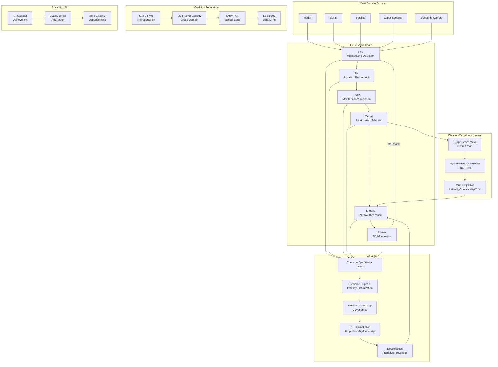
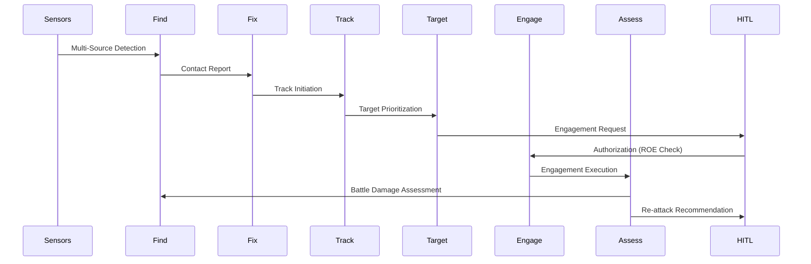
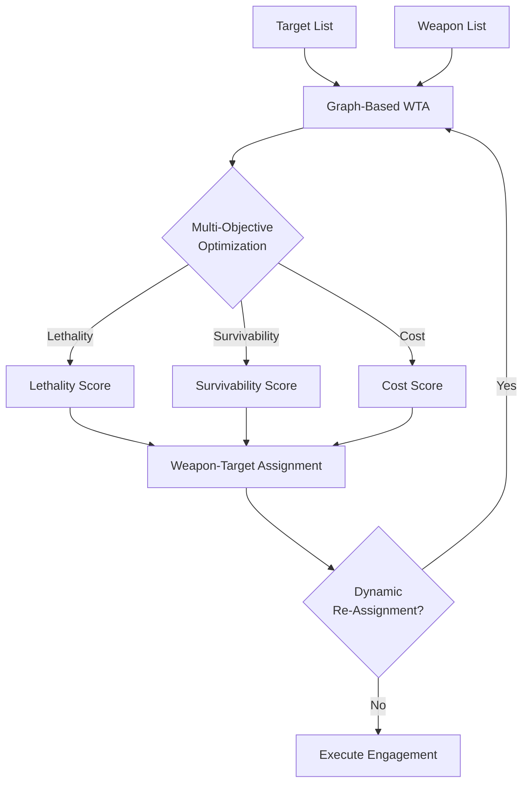
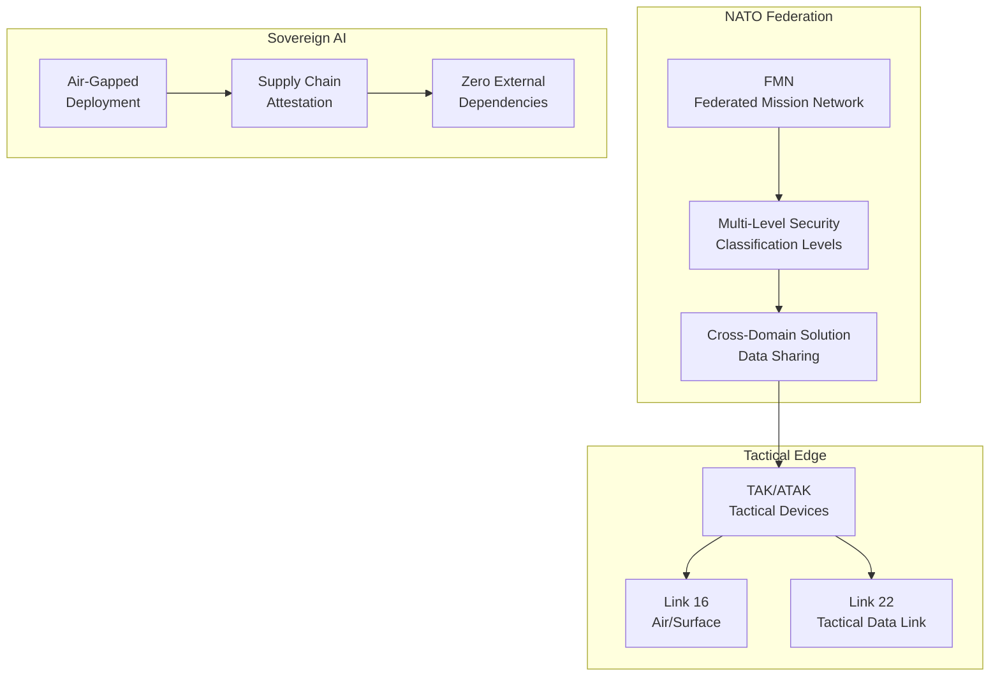

# Apex JADC2 — Joint All-Domain Command and Control

F2T2EA kill chain, coalition federation, sovereign AI, NATO interoperability.

## Architecture

## F2T2EA Kill Chain Flow

## WTA Optimization

## Coalition Federation

## Benchmark Comparisons

| Feature | Apex JADC2 | Palantir Gotham | Anduril Lattice | PTAH-OS-CJADC2 | God's Eye View |
|---------|-----------|-----------------|-----------------|-----------------|----------------|
| F2T2EA Kill Chain | ✅ Full | ✅ Partial | ✅ Partial | ✅ Full | ❌ |
| Coalition Federation | NATO FMN/MLS | ❌ | ❌ | ✅ | ❌ |
| Sovereign AI | Air-gapped/Zero deps | ❌ | ❌ | ❌ | ❌ |
| WTA | Graph-based optimization | ❌ | ❌ | ❌ | ❌ |
| ROE Compliance | Proportionality/Necessity | ❌ | ❌ | ❌ | ❌ |
| HITL Governance | ✅ | ✅ | ✅ | ❌ | ❌ |
| Open Source | AGPL-3.0 | ❌ | ❌ | ✅ | ✅ |
| NATO Interoperability | STANAG/MIP/NFFI | ❌ | ❌ | ❌ | ❌ |

## Tests

~372 tests, TDD-enforced.

## License

AGPL-3.0
